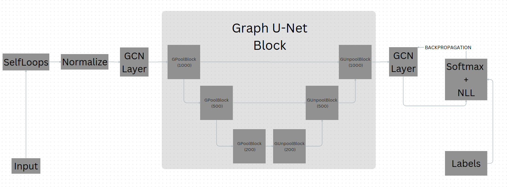

# Graph U-Nets variations

## Architecture

## Experiment

Experiments configuration can be found in [config.py](config.py).

To re-execute all experiments just execute [Train.ipynb](Train.ipynb) jupyter notebook.

## Results

| Experiment Name                                   | Number of blocks | Epoch | Acc Train | Acc Test | Acc Val |
| ------------------------------------------------- | ---------------- | ----- | --------- | -------- | ------- |
| GCN drop 0.2 not trainable self loops             | 0                | 200   | 1.0       | 0.778    | 0.748   |
| GCN drop 0.5 not trainable self loops             | 0                | 200   | 1.0       | 0.732    | 0.714   |
| Graph U-nets drop 0.2 k = [0.9] 1 block           | 1                | 200   | 0.857     | 0.642    | 0.62    |
| Graph U-nets drop 0.2 k = [0.9, 0.7] 1 block      | 1                | 200   | 1.0       | 0.769    | 0.76    |
| Graph U-nets drop 0.2 k = [0.9, 0.7, 0.5] 1 block | 1                | 200   | 1.0       | 0.786    | 0.75    |
| Graph U-nets drop 0.2 k = [0.9, 0.5] 1 block      | 1                | 200   | 1.0       | 0.769    | 0.748   |
| Graph U-nets drop 0.2 k = [0.9] 2 block           | 2                | 200   | 0.857     | 0.713    | 0.704   |
| Graph U-nets drop 0.2 k = [0.9] 3 block           | 3                | 200   | 0.857     | 0.56     | 0.554   |

## Docs

Latex report can be found at [Latex Report](docs/Graph_U_Nets_Variations.pdf)

PowerPoint presentation of the base Graph U-nets paper can be found at [Presentation](docs/Presentation.pdf).
